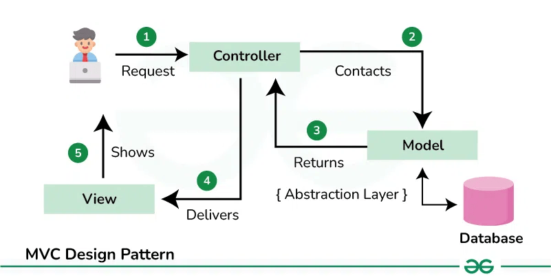

# Peak Performer

*Because you're always on top of the mountain (or at least your to-do list).*

## Introduction

Peak Performer is a simple yet robust to-do list application designed to keep you organized and productive. Built with Python and Flask, it leverages best practices in software design, including the Model-View-Controller (MVC) and Repository design patterns, ensuring scalability and maintainability.

## Table of Contents

- [Introduction](#introduction)
- [Features](#features)
- [Installation](#installation)
- [Usage](#usage)
- [Architecture](#architecture)
  - [Model-View-Controller (MVC)](#model-view-controller-mvc)
  - [Repository Design Pattern](#repository-design-pattern)
- [Dependencies](#dependencies)
- [Configuration](#configuration)
- [Troubleshooting](#troubleshooting)
- [License](#license)
- [Acknowledgement](#acknowledgement)

## Features

- User authentication (register, login, logout).
- Create, view, edit, and delete tasks.
- Role-based task management.
- API endpoint to fetch task details.
- Persistent data storage using PostgreSQL.

## Installation

1. Clone the repository:
   ```bash
   git clone https://github.com/your-repo/peak-performer.git
   cd peak-performer
   ```

2. Use the provided `run.sh` script for setup:
   - Create/load the virtual environment, install dependencies, and build PostgreSQL database:
    ```bash
    ./run.sh initial-setup
    ```

3. Start the application:
    ```bash
    ./run.sh run-app
    ```

## Usage

Access the application in your browser at `http://127.0.0.1:5001`.

### How to Use the App

#### 1. Login Page
- Navigate to the login page to access your account. Enter your username and password, then click **LOGIN**. New users can register by clicking "Sign Up".

<p align="center">
    
</p>

#### 2. Registration Page
- Create a new account by providing a username and a secure password. Ensure both password fields match before submitting.

<p align="center">
    
</p>

#### 3. Task Dashboard
- View all your tasks in a neatly organized table. The dashboard displays the task ID, title, description, and status. The task ID is cumulative for all tasks, across users, that are tracked in Peak Performer.

<p align="center">
    
</p>

#### 4. Add a Task
- Click "Add Task" in the navigation menu. Fill in the task title, description, and status, then click `Create Task`.

<p align="center">
    
</p>


#### 5. Edit a Task
- Select the "Edit Task" option. Enter the Task ID and update the desired fields. Leave fields blank to retain current values.

<p align="center">
    
</p>


#### 6. Delete a Task
- Choose the "Delete Task" option. Enter the Task ID to delete. Task details are fetched dynamically to ensure accuracy.

<p align="center">
    
</p>


#### 7. Log Out
- Use the "Log Out" option in the navigation menu to safely end your session.


## Architecture
### Model-View-Controller (MVC)
- **Model:**
  - Defined in `models.py`, representing `Users` and `Tasks` with SQLAlchemy.
- **View:**
  - HTML templates (e.g., `login.html`, `view_tasks.html`) extend `base.html` for a consistent UI.
  - Built with Bootstrap for responsive and elegant styling.
- **Controller:**
  - Route handling and logic in `auth_controller.py` and `tasks_controller.py`.

#### Benefits:
  - **Separation of Concerns:** Each component (Model, View, Controller) handles a distinct responsibility, avoiding overlap and reducing complexity.
  - **Improved Maintainability:** Changes to one layer (e.g., UI updates in the View) have minimal impact on others (e.g., Model or Controller).
  - **Scalability:** Enables the application to grow by adding new features or modules without disrupting existing functionality.
  - **Parallel Development:** Different teams can work on the UI, business logic, and database layers independently.

### MVC Design Pattern Visualization

<p align="center">
    
</p>

_Source: Geeks for Geeks_

### Repository Design Pattern
- **Repositories:**
  - `UsersRepository`: Handles CRUD operations for user accounts.
  - `TasksRepository`: Abstracts database logic for task management.

#### Benefits:
  - **Centralized Data Logic:** All database interactions are handled in repository classes, ensuring a clean separation of concerns.
  - **Easier Data Source Configuration:** Switching or adding new data sources (e.g., from PostgreSQL to MySQL) requires minimal changes in the repository layer only.
  - **Support for Multiple Data Sources:** Easily integrate and manage relational databases alongside external APIs or NoSQL databases.
  - **Simplified Testing:** Mocking repositories during tests avoids the need for live database connections.
  - **Reusability and Consistency:** Shared repository methods reduce duplication and streamline database operations.

## Configuration
- Set environment variables in a `.env` file, including:
    ```
    DB_USER=<your-database-user>
    DB_PASSWORD=<your-database-password>
    DB_HOST=<your-database-host>
    DB_PORT=<your-database-port>
    DB_NAME=<your-database-name>
    ```
- Customize app settings in `main.py` and static assets in `static/img`.

## Troubleshooting
- **Database Errors**: Ensure PostgreSQL is running and `.env` variables are correct.
- **Dependency Issues**: Use `./run.sh install-deps` to reinstall requirements.

## License
This project is licensed under the MIT License. See `LICENSE` for details.

## Acknowledgement
Peak Performer was in response to [roadmap.sh's Todo List API project](https://roadmap.sh/projects/todo-list-api).